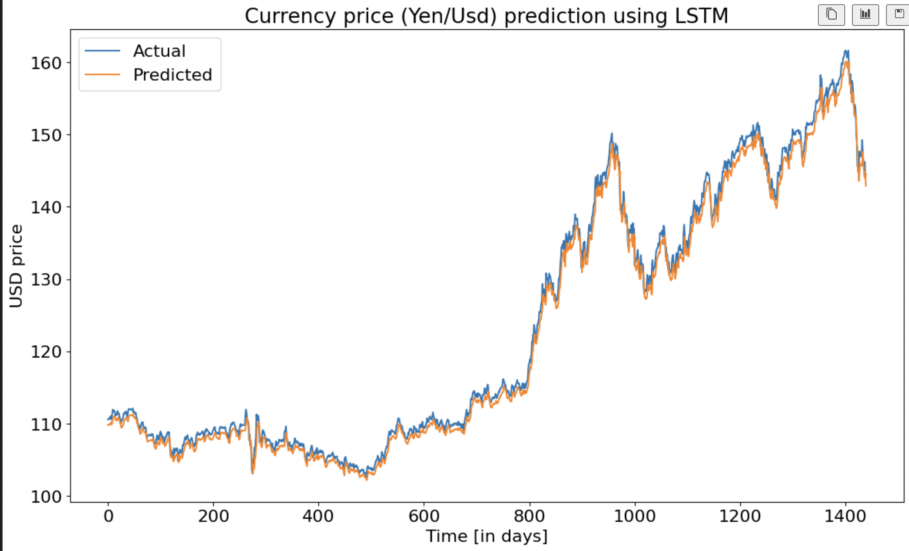

Project Summary: Forecasting JPY/USD Exchange Rate

Motivation: The recent volatility in the Japanese Yen poses significant currency risks for both Japanese and foreign companies. This research aims to develop an accurate predictive model for the JPY/USD exchange rate to help mitigate these risks.

Data Collection and Preparation:

Source: Yahoo Finance

Time frame: October 30, 1996 to September 4, 2024

Target variable: JPY/USD exchange rate

Model Development:

Model type: Long Short-Term Memory (LSTM) neural network

Input features: 3 lagged values of the exchange rate
Justification: Partial autocorrelation analysis revealed significant correlation only up to 3 lags

Model Performance:
Test set Mean Squared Error (MSE): 1.2649
Training set MSE: 1.1330
The model demonstrates strong predictive capabilities, as evidenced by the close alignment between predicted and actual values in the visualization provided.

Short-term Forecast:
The model projects a JPY/USD exchange rate of 139.03 for September 5, 2024.

Visualizations:
Partial Autocorrelation Function (PACF) plot justifying the use of 3 lags

Actual vs Predicted values plot showcasing the model's accuracy

5-day forecast plot illustrating the short-term prediction

Implications: This model can serve as a valuable tool for businesses and investors to anticipate currency movements and make informed decisions regarding international transactions and risk management strategies.

Future Work:
Incorporate additional relevant features such as interest rates and economic indicators
Explore ensemble methods to potentially improve forecast accuracy
Develop a user-friendly interface for easy access to predictions
By providing accurate short-term forecasts, this LSTM model offers a practical solution to navigate the challenges posed by JPY/USD exchange rate fluctuations
